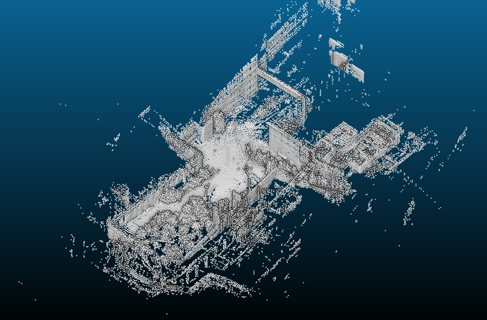

# PyLOAM
## Python version LOAM

PyLOAM is implemented based on LOAM (J. Zhang and S. Singh. LOAM: Lidar Odometry and Mapping in Real-time). 

## Requirements
- Python 3.6.9
- Numpy 1.19.1
- Open3D 0.10.0.0
- pypcd 0.1.1

## Usage

Currently I convert scans to `.npy` files.

`python3 src/main_loam.py --npy_path ${DATA_PATH}`

## References
- [LOAM: Lidar Odometry and Mapping in Real-time](https://frc.ri.cmu.edu/~zhangji/publications/JFR_2018.pdf)
- [loam_velodyne](https://github.com/daobilige-su/loam_ve)
- [A-LOAM](https://github.com/HKUST-Aerial-Robotics/A-LOAM)

## TODOs

Many stuff are still under development:

- Configuration class
- Visualization
- Evaluation

## Example

Mapped feature points from [NSH indoor outdor](http://wiki.ros.org/loam_velodyne) dataset.

